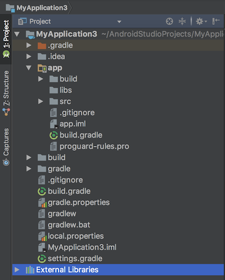
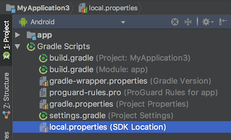

# 궁금했지만 항상 그냥 지나쳤던 안드로이드에서의 Gradle, 얉게 한번 파보자. ~~사실 별로 궁금해하지 않고 그냥 사용 하는 경우가 대다수..~~

## Gradle? 그래들? 그레이들?

- 책에서서는 ‘그레이들’로 발음하는 경우가 많음
- 어차피 한글로 구글링해도 gradle로 검색됨
- 결론: 그래-들
- 빌드 자동화 툴 (친구들: ant, maven, make)

## 빌드란 무엇인가?

> 내가 작성한 코드를 `apk(android package)`, `aar(android archive)`로 만드는 과정

---

## 안드로이드 기본 프로젝트 구조를 살펴보자

Project 로 보기



Android 로 보기



## Gradle 관련 파일

build.gradle (Project: MyAppliation): 크게 두 부분

```gradle
buildscript {
    repositories {
        jcenter()
    }
    dependencies {
        classpath 'com.android.tools.build:gradle:2.3.0'
    }
}

allprojects {
    repositories {
        jcenter()
    }
}

task clean(type: Delete) {
    delete rootProject.buildDir
}
```

build.gradle (Module: app): 크게 네 부분

```gradle
apply plugin: 'com.android.application'

android {
    compileSdkVersion 25
    buildToolsVersion "25.0.2"
    defaultConfig {
        applicationId "com.example.ragu.myapplication"
        minSdkVersion 19
        targetSdkVersion 25
        versionCode 1
        versionName "1.0"
        testInstrumentationRunner "android.support.test.runner.AndroidJUnitRunner"
    }
    buildTypes {
        release {
            minifyEnabled false
            proguardFiles getDefaultProguardFile('proguard-android.txt'), 'proguard-rules.pro'
        }
    }
}

dependencies {
    compile fileTree(dir: 'libs', include: ['*.jar'])
    androidTestCompile('com.android.support.test.espresso:espresso-core:2.2.2', {
        exclude group: 'com.android.support', module: 'support-annotations'
    })
    compile 'com.android.support:appcompat-v7:25.3.0'
    testCompile 'junit:junit:4.12'
    compile 'com.android.support.constraint:constraint-layout:1.0.2'
}
```

gradle.settings

```gradle
include ':app'
```

gradle.properties

```gradle
systemProp.http.proxyHost=70.10.15.10
systemProp.http.proxyPort=8080
systemProp.http.nonProxyHosts=70.*|localhost

systemProp.https.proxyHost=70.10.15.10
systemProp.https.proxyPort=8080
systemProp.https.nonProxyHosts=70.*|localhost
```

## Gradle은 그루비로 작성되어 있다

> Groovy is an agile and dynamic language for the Java Virtual Machine.

### 그루비란 무엇인가?

> Groovy는 자바에 파이썬, 루비, 스몰토크등의 특징을 더한 동적 객체 지향 프로그래밍 언어입니다.  JVM에서 동작하고 자바의 강점 위에서 파이썬, 루비, 스몰토크 등의 프로그래밍 언어에 영향을 받은 특징 및 장점이 있습니다. 자바 기반이기 때문에 자바 프로그래머들이 많은 학습을 하지 않아도 프로그래밍을 할 수 있다는 점과 단순화된 문법을 지원하여 코드를 읽고 유지보수하기 편하다는 장점이 있습니다. by [불곰 블로그](http://brownbears.tistory.com)

### TODO DSL 내용 간단하게 추가 Domain Specific Language

---

## 저장소 비교

```gradle
repositories {
    jcenter()
}
```

저장소 이름|운영사|속도|규모|안드로이드 스튜디오 기본 저장소|사용자 친화도
-|-|-|-|-|-
jcenter|bintray.com|빠름(CDN 사용)|더큼|현재|높음(쉬움)
manveCentral|sonatype.org|덜빠름|큼|과거|낮음(어려움)

> bintray.com은 `jcenter`에서 `maven central`으로 배포하는 기능을 제공한다.

### 그 외 여러가지 저장소 설정 예

로컬에 있는 메이븐 캐시 사용

```gradle
repositories {
    mavenLocal()
}
```

로컬 파일 시스템에 있는 라이브러리 파일 참조

```gradle
repositories {
    flatDir {
        dirs 'lib'
    }
}
```

기타 메이븐 저장소 url을 직접 지정

```gradle
repositories {
    maven {
        url 'http://repo.mycompony.com/maven'
    }
}
```

비밀번호가 걸려있는 저장소

```gradle
repositories {
    maven {
        credentials {
            username 'username'
            password 'password'
        }
        url 'http://repo.mycompony.com/maven'
    }
}
```

---

## SDK Version

속성 이름|내용
-|-
compileSdkVersion|컴파일에 사용할 SDK 버전
minSdkVersion|지원하는 최소 SDK 버전으로, SDK 버전이 이 값보다 낮은 기기에서는 해당 어플리케이션을 검색할 수 없음.
targetSdkVersion|어플리케이션이 의도하는 목적 SDK 버전. 최신버전보다 낮으면 안드로이드 스튜디오에서 경고 표시됨.

## applicationId(패키지 이름으로 많이 불림)

- 구글 플레이 스토어에서 유일한 이름이어야 한다.
- 한번 마켓에 올라가면 변경되어서는 안된다. -> 만약 변경하게되면 전혀 다른 앱이 된다.

## 빌드 타입 이해하기

```gradle
buildTypes {
    release {
        minifyEnabled false
        proguardFiles getDefaultProguardFile('proguard-android.txt'), 'proguard-rules.pro'
    }
}
```

- debug
- release

> 명시하지 않으면 기본 설정이 적용됨.

---

## 외부 라이브러리 추가

```gradle
dependencies {
    compile fileTree(dir: 'libs', include: ['*.jar'])
    androidTestCompile('com.android.support.test.espresso:espresso-core:2.2.2', {
        exclude group: 'com.android.support', module: 'support-annotations'
    })
    compile 'com.android.support:appcompat-v7:25.1.0'
    testCompile 'junit:junit:4.12'
}
```

### Configuration

- compile, testCompile, androidTestCompile
- debugCompile, releaseCompile
- annotationProcessor, testAnnotationProcessor

### 라이브러리 위치 지정

- 로컬 파일 시스템 : files('~', '~', ...) or fileTree(dir: '~', include: '~')
  > 실무에서는 외부에 공개된 라이브러리가 아닌 특정 회사에만 공개된 private 라이브러리를 참조하는 경우에만 사용한다. by 안드로이드를 위한 Gradle(저자: 유동환)
- 외부 저장소 : group: '~', name: '~', veresion: '~' / 'group:name:version'
  - ex) group: 'com.android.support', name: 'appcompat', version: '25.1.0'
- android library : 'group:name:version**@aar**'
- version 명시 : 'junit:junit:4.+' 와 같은 방법은 

---

## support-v4 vs. appcompat-v7

### Support Library

> 이전 안드로이드 버전을 사용하고 있는 기기에서 새로운 API를 사용 할수 있도록 도와주는 호환성 라이브러리이며 새로운 안드로이드 버전이 나올때 마다 업데이트 된다. 주요 호환성 라이브러리로는 V4및 V7-AppCompat이 있다.

- support-v4

  > 안드로이드 API4부터 사용이 가능한 라이브러리로 API 11에서 소개된 Fragment와 Loader등 주요 클래스의 구현을 지원하며 ViewPager, DrawerLayout등 포함 되어 있다.

- appcompat-v7

  > V4를 이용하여 확장한 라이브러리로 단순히 액션바(API 11), 툴바(API 21)등을 지원한다.

안드로이드 스튜디오의 새로운 프로젝트 템플릿을 보면 support-v4와 appcompat-v7을 기본적으로 포함시켜 개발자로 하여금 의존할 수 있도록 노력하고있다. 즉, 서포트 라이브러리가 필요 하지 않는 경우라도 일반적으로 사용하기를 구글에서는 권하고 있다. by [꿈꾸는 개발자의 로그 블로그](http://www.kmshack.kr/2015/06/android-support-library/)

---

## productFlavors

```gradle
productFlavors {
        internal {
            buildConfigField 'String', 'proxyHost', '"' + PROXY_HOST + '"'
            buildConfigField 'int', 'proxyPort', PROXY_PORT
            buildConfigField 'String', 'certKeystoreDigest', '"' + CERT_KEYSTORE_DIGEST + '"'
        }

        production {
            buildConfigField 'String', 'proxyHost', 'null'
            buildConfigField 'int', 'proxyPort', '0'
            buildConfigField 'String', 'certKeystoreDigest', 'null'
        }
    }
```

---

## 태스크에 대한 자세한 설명은 생략하나, 기본 내장 태스크는 알고가자

- assemble : application -> apk, library -> aar
- check : lint without test
- build : assemble + check
- clean : remove all of things of build result

### Lint 란 무엇인가?

사전적 의미 -> 보푸라기

의심스럽거나, 에러를 발생하기 쉬운 코드에 flag 를 달아 놓는 것

Android Lint에서 검사하는 항목 중 대표적인 부분

- 사용하지 않는 리소스
- 국제화(I18N; Internationalization) 지원시 이상 여부
- 성능상 문제가 될 수 있는 부분
- minSdkLevel, targetSdkLevel, compileSdkLevel에 따라 오류가 발생할 수 있는 부분

## 명령창에서 Gradle 빌드 실행하기

```shell
> ./gradlew clean assembleDebug
```

---

## 부록 A : 책 소개


~~책 소개를 가장한 노트북 자랑질...~~


- 110 페이지
- 국내도서
- 2016년 7월
- 안드로이드 특화
- 이틀
- 일단 얇아서 좋고, 안드로이드에서 사용하는 Gradle을 전반적으로 빠르게 훑어볼 수 있어서 더 좋다.


- 620 페이지
- 번역서(일본)
- 2015년 12월
- 안드로이드 특화 아님
- 하루


- 171 페이지
- 번역서(미쿡)
- 2016년 12월
- 안드로이드 특화
- 일주일째 보는 중
- 발생할 수 있는 문제를 말하고 거기에 대한 해결책을 제시해 가면서 점점 자세한 설명으로 들어가는 형태로 되어있어서 지겹지 않음.

---

## backlog
  
  - buildToolVersion vs. plugin version
  
  - 안드로이드 빌드 툴(오른쪽에 나오는거), 플러그인(application, libary, java 등) 설명
  - debug, release
  - 빌드 변형 구성 flavor(product, demo, full)
  - flavor 실제 코드에 적용시키는 방법
  -